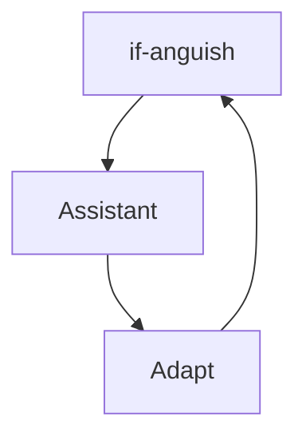
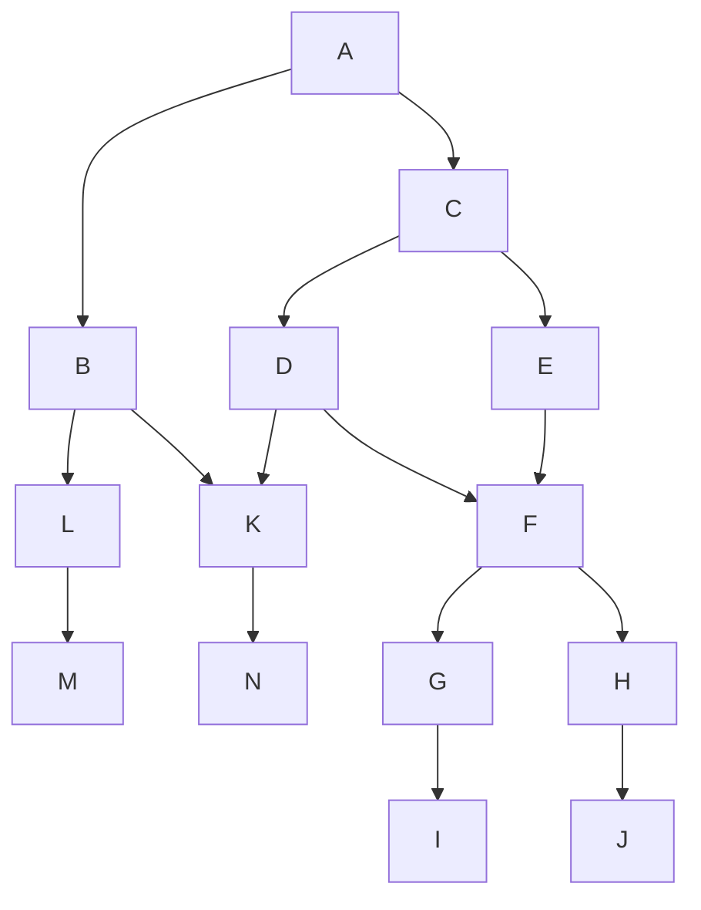

# Preset-vb
Outil pour ouvrir des preset pré-déterminé.
#Automation tool. Allows you to open several queries at the same time.

#1- Replace existing paths with your own.

#2- Add this code to your task scheduler.

#3- User and open your Software or web pages and be ready to work in 2 clicks.

## HumeurV2 is a mental health assistant created during confinement:

# Logic 

